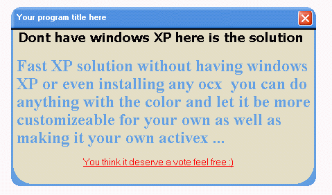



## No XP But XP

### Description

Here is a nice way when you dont have windows XP and without any ocx controll skinning your vb forms, you can add more functions to make it customizeable for your need, thx a lot guys
 
### More Info
 

             |
---                |---
**Submitted On**   |2003-03-28 08:14:36
**By**             |[kegham](https://github.com/Planet-Source-Code/PSCIndex/blob/master/ByAuthor/kegham.md)
**Level**          |Advanced
**User Rating**    |4.1 (29 globes from 7 users)
**Compatibility**  |VB 5\.0, VB 6\.0
**Category**       |[Graphics](https://github.com/Planet-Source-Code/PSCIndex/blob/master/ByCategory/graphics__1-46.md)
**World**          |[Visual Basic](https://github.com/Planet-Source-Code/PSCIndex/blob/master/ByWorld/visual-basic.md)
**Archive File**   |[No\_XP\_But\_1565373282003\.zip](https://github.com/Planet-Source-Code/kegham-no-xp-but-xp__1-44306/archive/master.zip)

